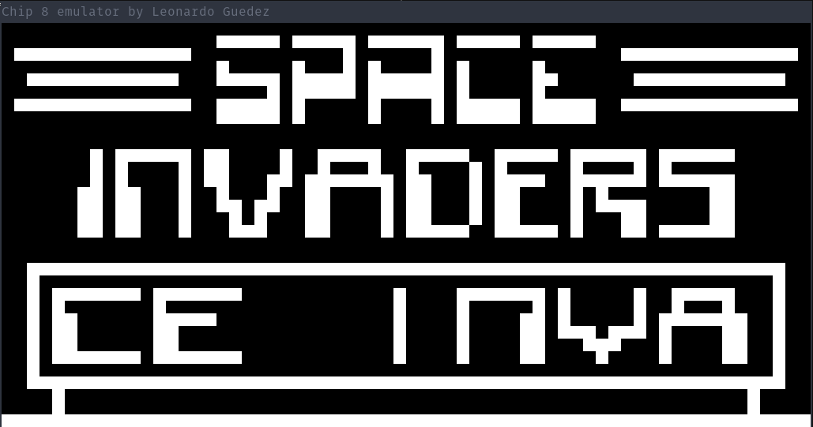
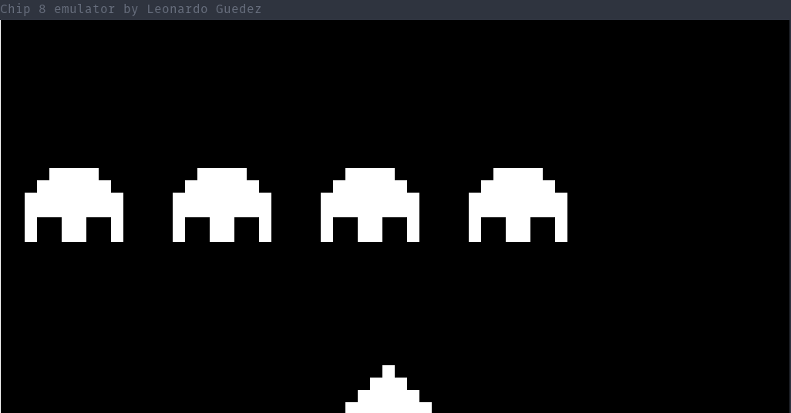
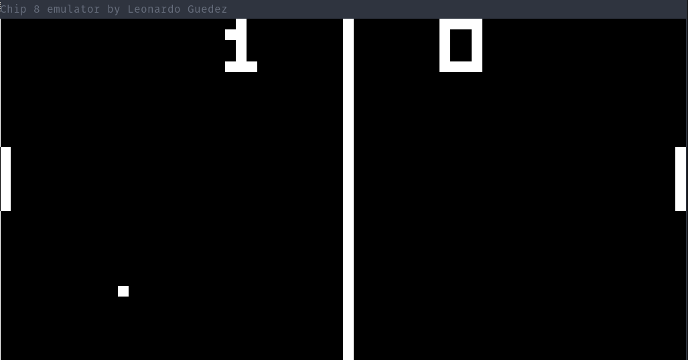
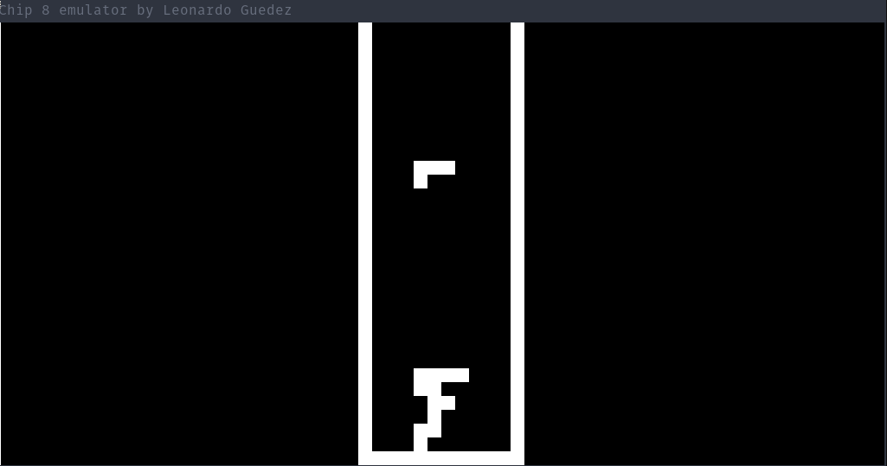
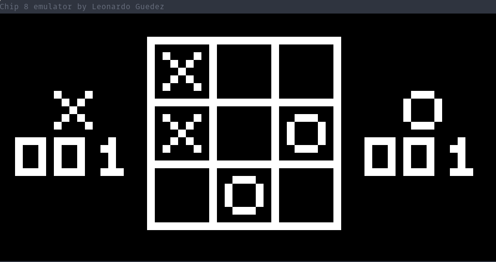

# CHIP-8-interpreter
An interpreter for the CHIP-8 programming language written in C

# What is CHIP-8?


CHIP-8 CHIP-8 is an interpreted programming language developed by Joseph Weisbecker in the 1970's.
It was initially used on the COSMAC VIP and Telmac 1800 8-bit microcomputers. CHIP-8 programs are meant to be run on a virtual machine, although call it an _emulator_, because most of the implementations try to emulate the machines in which it was originally developed and used. Its main objective was to simplify videogame programming at the time, for the machines it was intended for.

# Screenshots

* Space Invaders - Initial screen


* Space Invaders - game screen


* Pong


* Tetris


* Tic Tac Toe


# Features

* It works (_cough_ sort of _cough_)
* It doesn't crash (most of the times)
* It doesn't kills your computer (hope so)
* Implemented all the opcodes

# Planned features
* Multi-platform support (main targets are Windows and OS X)
* Implement sound
* Command line options (like help, show keymaps, etc)
* Support for keys to, for example, reset the interpreter, change game without having to close the windows first, pause/unpause, etc.

# Technical details

The characteristics of the virtual machine, as found on the internet, are the following:

Memory:
--------
CHIP-8 was most commonly implemented in machines with 4K of RAM (like the Cosmac VIP and the Telmac 1800), so this interpreter does the same. Each location is 8-bits wide (1 byte). However, the first 512 (addresses 0x0 - 0x1FF) bytes were reserved for the interpreter itself, so application memory starts at byte 512 (address 0x200).

Registers:
----------
16 8-bit data registers, named V0, V1, V2, ..., VE, VF. VF is special thou, used as a flag for many operations, so it should not be used as a general purpose register by applications. Also, there is the I register, which is 16-bits wide and is used to store addresses. The Delay and Sound timers are two 8-bit registers, used for timing the events of games and playing sound, respectively.

Also, there is a stack pointer, a program counter and a stack. The stack is used to store the return address before calling a subroutine, and has 16 memory locations (because CHIP-8 admitted a maximum os 16 nested calls), each 16-bits wide. The stack pointer is also 16-bits wide. The program counter can be 8-bit wide, although here is implemented as 16-bit.

Keyboard:
---------
The computers which originally used the Chip-8 Language had a 16-key hexadecimal keypad with the following layout:
```
_________
|1|2|3|C|
|4|5|6|D|
|7|8|9|E|
|A|0|B|F|
_________
```

In this implementation, it's mapped to the keys: 1 2 3 4  q w e r  a s d f  z x c v on a modern QWERTY keyboard.

Display:
--------
64x32 pixel monochrome display. CHIP-8 draws graphics on the screen by drawing sprites, which are stored on specific memory locations. For example, the font set is stored in the first 80 bytes of memory, which is not used by application programs.


# Building from sources

Until now it has only been tested on Debian GNU/Linux 9.3 (Stretch). Support for other platforms is planned.
The interpreter is written in C99, so a proper compiler is needed. A recent version of GCC or Clang should be fine.
The only dependencies are [SDL 2](https://www.libsdl.org/) and the make utility to build the project. Installation
of SDL is very platform specific, so links to the download pages are provided at the end of this file. To install make
you need to:

```
sudo apt install make
```

Then, to build the project, go to the root directory of it and type:

```
make
```

It will generate an executable file, called `chip8`. To run it, you need to pass it the path to the rom file, like shown below:

```
./chip8 roms/PONG
```

You could also build the debug version, which prints a lot of boring stuff to the screen:

```
make debug
```

It will generate a file called `debug`, which you can run the same way as explained above.

You can close the window pressing the ESCAPE key.


# Resources
This is a list of the various resources that I used to develop the interpreter:

* http://www.multigesture.net/articles/how-to-write-an-emulator-chip-8-interpreter/
* http://mattmik.com/files/chip8/mastering/chip8.html
* https://en.wikipedia.org/wiki/CHIP-8
https://www.libsdl.org/download-2.0.php (Main SDL download page)
* https://wiki.libsdl.org/Installation#Linux.2FUnix (Instructions to install SDL on Linux)
